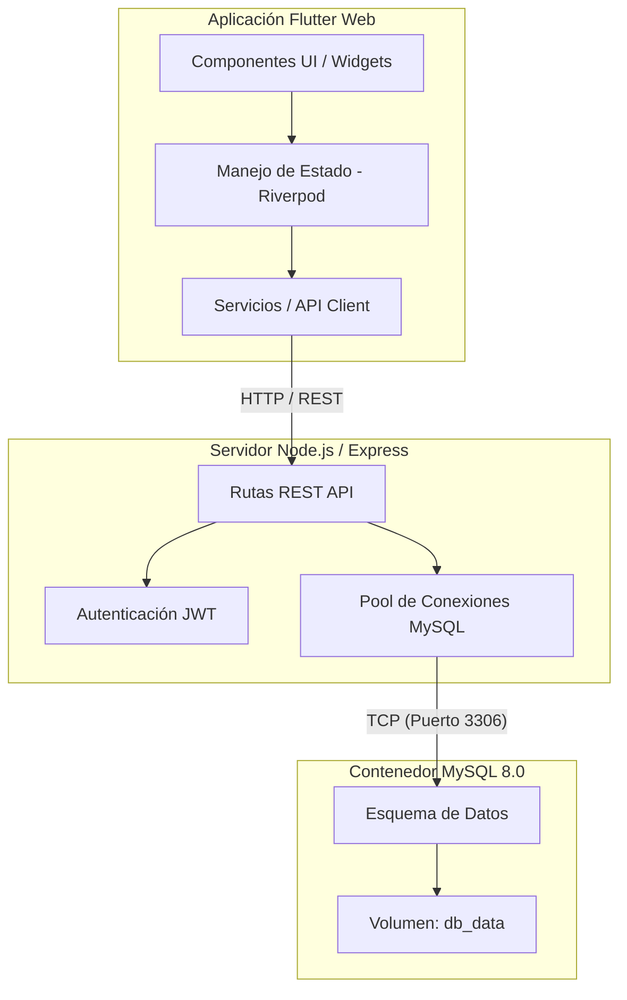

# Sheepy

Sheepy es una aplicación diseñada para facilitar la lectura y el aprendizaje de la Biblia, adoptando un enfoque gamificado. Los usuarios avanzan a través de capítulos leyendo versículos, completando quizzes dinámicos y ganando experiencia y monedas para escalar en ligas competitivas.

El proyecto está compuesto por tres partes principales, unificadas y orquestadas con Docker para garantizar una instalación robusta y con persistencia de datos.

---

## Arquitectura y Estructura del Código

La aplicación sigue una arquitectura cliente-servidor contenedorizada. A continuación se presenta el diagrama de componentes principales:



### Principios SOLID y Filosofía de Diseño

El diseño del proyecto se rige por buenas prácticas de ingeniería de software, enfocándose fuertemente en el mantenimiento y la escalabilidad:

1. **Principio de Responsabilidad Única (SRP):** 
   - En el backend, las rutas, la lógica de autenticación y la inicialización de la base de datos están separadas. 
   - En el frontend (Flutter), los componentes visuales (`widgets`), el manejo de estado (`providers`) y la comunicación con el servidor (`services`) tienen fronteras claramente delimitadas.

2. **Inversión de Dependencias (DIP) e Inyección de Dependencias:**
   - En Flutter, se utiliza **Riverpod** para inyectar dependencias (como `authServiceProvider` o `quizServiceProvider`). Esto permite que los widgets dependan de abstracciones en el estado global, facilitando las pruebas y la refactorización sin acoplar directamente la lógica de negocio a la capa de presentación.

3. **Arquitectura Reactiva:**
   - La interfaz de usuario es puramente declarativa y reactiva a los cambios de estado del modelo. Cuando los puntos del usuario o la racha cambian, los `Providers` de Riverpod actualizan únicamente las partes de la interfaz de usuario que dependen de esa información, garantizando un rendimiento óptimo (60 FPS).

---

## Criterios de Seguridad y Decisiones de Diseño

- **Hashing de Contraseñas:** 
  Las contraseñas de los usuarios nunca se almacenan en texto plano. El backend utiliza bibliotecas de criptografía (como `bcrypt`) para generar un *hash* seguro con su respectivo *salt*. Esto asegura que, incluso en el caso hipotético de que la base de datos sea comprometida, las contraseñas originales no puedan ser derivadas ni leídas.

- **Autenticación Stateless con JWT:**
  La aplicación no maneja sesiones en memoria del lado del servidor. En su lugar, se emite un JSON Web Token (JWT) firmado por el backend. El cliente almacena este token de manera segura y lo envía en el encabezado de autorización HTTP en cada petición. Esto permite escalar el backend horizontalmente sin preocuparse por la afinidad de sesión.

- **Persistencia de Datos (Volúmenes Docker):**
  Para evitar la pérdida accidental de información al recrear los contenedores, se ha configurado el volumen persistente `db_data`. Este volumen mapea físicamente el directorio `/var/lib/mysql` hacia el host, permitiendo que la información (usuarios, progreso, rachas) sobreviva a ciclos de `docker-compose down`.

- **Migraciones Automáticas Seguras:**
  El archivo `server.ts` incluye scripts de inicialización que actúan como sistema de auto-migración. En lugar de usar herramientas complejas, el backend verifica y crea la estructura base de datos de manera incremental e idempotente.

---

## Requisitos Previos

- Docker instalado en el sistema.
- Docker Compose.

---

## Configuración de Variables de Entorno (.env)

El backend requiere ciertas variables de entorno para funcionar correctamente. En el entorno de Docker, muchas de estas ya se pasan a través del archivo `docker-compose.yml`, pero para desarrollo local (fuera de Docker) es buena práctica contar con un archivo `.env` en la carpeta `backend_sheepy`.

Crea un archivo llamado `.env` en `backend_sheepy/` con el siguiente contenido base:

```env
DB_HOST=localhost
DB_USER=root
DB_PASSWORD=tu_password_aqui
DB_NAME=biblia_rv1909
DB_PORT=3308
PORT=3000
JWT_SECRET=super_secret_jwt_key_sheepy_2026
```

*(Nota: En producción, `JWT_SECRET` y `DB_PASSWORD` deben ser cadenas complejas y nunca compartidas públicamente).*

---

## Instalación y Ejecución

La manera más sencilla de probar y ejecutar Sheepy es a través de `docker-compose`. Esto preparará la red virtual, la base de datos, el backend, y compilará la aplicación web de Flutter.

1. Abrir una terminal o línea de comandos.
2. Navegar hasta la carpeta raíz del proyecto (donde se encuentra `docker-compose.yml`).
3. Ejecutar el siguiente comando para construir e iniciar todos los servicios:

```bash
docker-compose up --build -d
```

> Nota: La primera ejecución tardará unos minutos debido a la descarga del entorno de compilación de Flutter y los paquetes NPM. Las ejecuciones posteriores serán casi instantáneas.

---

## Cómo probar la Aplicación

Una vez que el comando haya terminado exitosamente, todos los servicios estarán operativos:

- **Interfaz de la App (Frontend):** http://localhost:8085
- **Backend (API Node.js):** http://localhost:3000
- **Base de Datos (MySQL):** Puerto `3308` (localhost)
  - Usuario: `root`
  - Contraseña: `tu_password_aqui`
  - Base de datos: `biblia_rv1909`

### Flujo recomendado para nuevos usuarios:
1. Acceder a http://localhost:8085.
2. Hacer clic en "Regístrate" para crear una cuenta nueva.
3. Iniciar sesión y navegar a la pestaña de "Libros".
4. Seleccionar el libro deseado, volver al "Camino" y entrar al primer capítulo disponible.
5. Completar la lectura, pasar al "Quiz" y acertar las preguntas.
6. Observar los cambios visuales, la obtención de experiencia y el posicionamiento en la pestaña "Ligas".

---

## Detener, Reiniciar o Limpiar el entorno

**Para detener temporalmente los servicios** (sin perder datos):
```bash
docker-compose stop
```

**Para reanudar los servicios:**
```bash
docker-compose start
```

**Para destruir y eliminar los contenedores y la red** (manteniendo los datos en el volumen):
```bash
docker-compose down
```

**Peligro: Reseteo de Fábrica completo**
Si se desea realizar una limpieza absoluta y borrar permanentemente la base de datos (perdiendo todas las cuentas y progreso), utilizar:
```bash
docker-compose down -v
```

---

## Desarrollo Móvil (Android/iOS)

Para ejecutar la aplicación de Flutter de manera nativa en un emulador o dispositivo físico con "Hot Reload":

1. **Levantar únicamente el Backend y la BD:**
   No es necesario correr el contenedor del frontend si vas a probar en un dispositivo físico o emulador. Inicia solo los servicios necesarios:
   ```bash
   docker-compose up -d db backend
   ```

2. **Averiguar tu IP Local:**
   Tu celular (o emulador) necesitará conectarse a tu computadora a través de tu red Wi-Fi/LAN, por lo que `localhost` no funcionará. Busca tu dirección IPv4 (ej. `192.168.1.55`):
   - Windows: `ipconfig`
   - macOS/Linux: `ifconfig`

3. **Ejecutar Flutter inyectando la IP:**
   Navega a la carpeta del frontend y ejecuta la aplicación indicando la URL completa (incluyendo `http://` y el puerto `:3000`):

   ```bash
   cd sheepy_app
   flutter pub get
   flutter run --dart-define=BIBLE_API_HOST=http://[TU_IP_LOCAL]:3000
   ```
   
   *(Si usas VS Code para depurar, puedes agregar `--dart-define=BIBLE_API_HOST=http://[TU_IP_LOCAL]:3000` dentro del array `"args"` en tu archivo `.vscode/launch.json`).*
