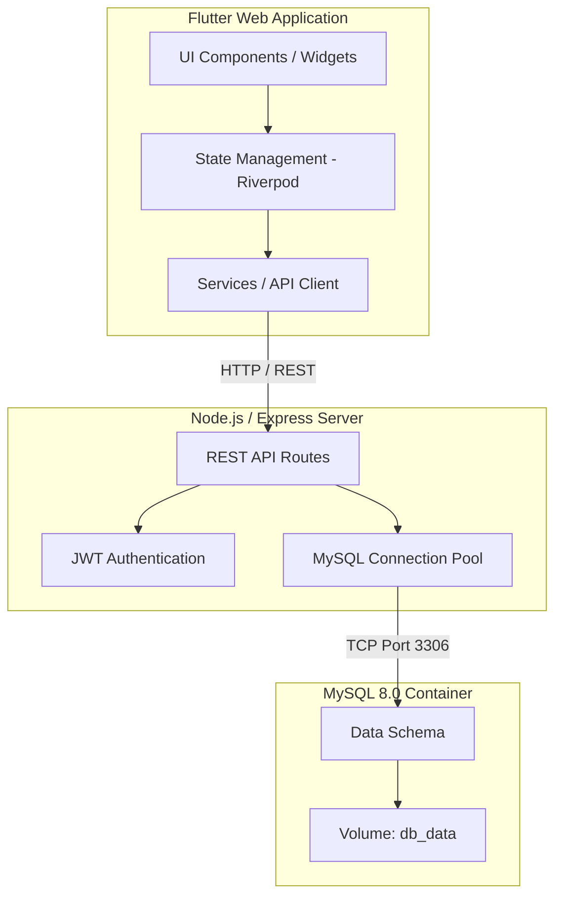

# Sheepy

Sheepy is a gamified application designed to facilitate reading and learning the Bible. Users progress through chapters by reading verses, completing dynamic quizzes, and earning experience and coins to climb competitive leagues.

The project consists of three main components, orchestrated with Docker to guarantee robust installation and data persistence.

For a visual guide on how to use the app, refer to the [User Manual](USER_MANUAL.md).

---

## Tech Stack

- **Frontend:** Flutter Web (Dart) with Riverpod for state management.
- **Backend:** Node.js, Express, TypeScript.
- **Database:** MySQL 8.0.
- **Infrastructure:** Docker and Docker Compose.

---

## Architecture and Code Structure

The application follows a containerized client-server architecture. Below is the primary component diagram:



### SOLID Principles and Design Philosophy

The project design adheres to strong software engineering practices, focusing heavily on maintainability and scalability:

1. **Single Responsibility Principle (SRP):**
   - In the backend, routing, authentication logic, and database initialization are separated.
   - In the frontend (Flutter), visual components (`widgets`), state management (`providers`), and server communication (`services`) have clearly defined boundaries.

2. **Dependency Inversion Principle (DIP) and Dependency Injection:**
   - In Flutter, **Riverpod** is used to inject dependencies (like `authServiceProvider` or `quizServiceProvider`). This allows widgets to depend on abstractions in the global state, facilitating testing and refactoring without coupling business logic directly to the presentation layer.

3. **Reactive Architecture:**
   - The user interface is purely declarative and reactive to model state changes. When a user's points or streak change, Riverpod's `Providers` update only the parts of the UI that depend on that information, ensuring optimal performance (60 FPS).

---

## Security Criteria and Design Decisions

- **Password Hashing:**
  User passwords are never stored in plain text. The backend uses cryptographic libraries (such as `bcrypt`) to generate a secure hash with its respective salt. This ensures that even if the database is compromised, the original passwords cannot be derived or read.

- **Stateless Authentication with JWT:**
  The application does not manage in-memory sessions on the server side. Instead, a JSON Web Token (JWT) signed by the backend is issued. The client stores this token securely and sends it in the HTTP authorization header with each request. This allows the backend to scale horizontally without worrying about session affinity.

- **Data Persistence (Docker Volumes):**
  To prevent accidental data loss when recreating containers, the persistent volume `db_data` is configured. This volume physically maps the `/var/lib/mysql` directory to the host, allowing user information, progress, and streaks to survive `docker-compose down` cycles.

- **Secure Automatic Migrations:**
  The `server.ts` file includes initialization scripts that act as an auto-migration system. The backend verifies and incrementally creates the database structure safely.

---

## Database Initialization (Important)

To ensure the environment functions correctly, the database must be populated with the initial biblical data. 
Inside the `files_to_upload/` directory, you will find two CSV files (for example, `books_202606171158.csv` and `verses_202606171158.csv`). 

**You must upload the data from these CSV files into the `books` and `verses` tables respectively.**
This can be done using a SQL client like DBeaver or MySQL Workbench by importing the CSV data into the database instance exposed on port `3308`.

---

## Prerequisites

- Docker installed on the system.
- Docker Compose.

---

## Environment Variables (.env) Setup

The backend requires certain environment variables to run. In the Docker environment, these are passed via the `docker-compose.yml` file, but for local development (outside Docker), it is best practice to have a `.env` file in the `backend_sheepy` folder.

Create a `.env` file inside `backend_sheepy/` with the following base content:

```env
DB_HOST=localhost
DB_USER=root
DB_PASSWORD=your_password_here
DB_NAME=biblia_rv1909
DB_PORT=3308
PORT=3000
JWT_SECRET=super_secret_jwt_key_sheepy_2026
```

*(Note: In production, `JWT_SECRET` and `DB_PASSWORD` must be complex strings and never shared publicly).*

---

## Installation and Execution

The simplest way to test and run Sheepy is using `docker-compose`. This prepares the virtual network, database, backend, and compiles the Flutter web application.

1. Open a terminal or command prompt.
2. Navigate to the root folder of the project (where `docker-compose.yml` is located).
3. Run the following command to build and start all services in the background:

```bash
docker-compose up --build -d
```

> Note: The first run will take a few minutes due to the downloading of the Flutter build environment and NPM packages. Subsequent runs will be nearly instantaneous.

---

## How to Test the Application

Once the command has completed successfully, all services will be operational:

- **App Interface (Frontend):** http://localhost:8085
- **Backend (Node.js API):** http://localhost:3000
- **Database (MySQL):** Port `3308` (localhost)
  - User: `root`
  - Password: `your_password_here`
  - Database: `biblia_rv1909`

### Recommended Flow for New Users:
1. Navigate to http://localhost:8085.
2. Click "Register" to create a new account.
3. Log in and navigate to the "Books" tab.
4. Select the desired book, return to the "Path" tab, and enter the first available chapter.
5. Complete the reading, proceed to the "Quiz", and answer the questions correctly.
6. Observe visual changes, experience gain, and positioning in the "Leagues" tab.

---

## Stop, Restart or Clean the Environment

**To temporarily stop services** (without losing data):
```bash
docker-compose stop
```

**To resume services:**
```bash
docker-compose start
```

**To destroy and remove containers and network** (keeping data in the volume):
```bash
docker-compose down
```

**Warning: Full Factory Reset**
To perform an absolute cleanup and permanently delete the database (losing all accounts and progress), use:
```bash
docker-compose down -v
```

---

## Mobile Development (Android/iOS)

To run the Flutter application natively on an emulator or physical device with "Hot Reload":

1. **Start only the Backend and DB:**
   It is not necessary to run the frontend container if you are testing on a physical device or emulator. Start only the necessary services:
   ```bash
   docker-compose up -d db backend
   ```

2. **Find your Local IP:**
   Your mobile device (or emulator) needs to connect to your computer through your Wi-Fi/LAN network, so `localhost` will not work. Find your IPv4 address (e.g. `192.168.1.55`):
   - Windows: `ipconfig`
   - macOS/Linux: `ifconfig`

3. **Run Flutter injecting the IP:**
   Navigate to the frontend folder and run the application indicating the full URL (including `http://` and the `:3000` port):

   ```bash
   cd sheepy_app
   flutter pub get
   flutter run --dart-define=BIBLE_API_HOST=http://[YOUR_LOCAL_IP]:3000
   ```
   
   *(If you use VS Code for debugging, you can add `--dart-define=BIBLE_API_HOST=http://[YOUR_LOCAL_IP]:3000` inside the `"args"` array in your `.vscode/launch.json` file).*
