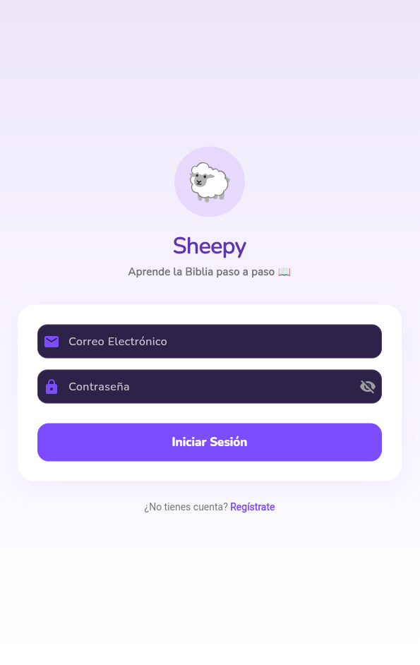
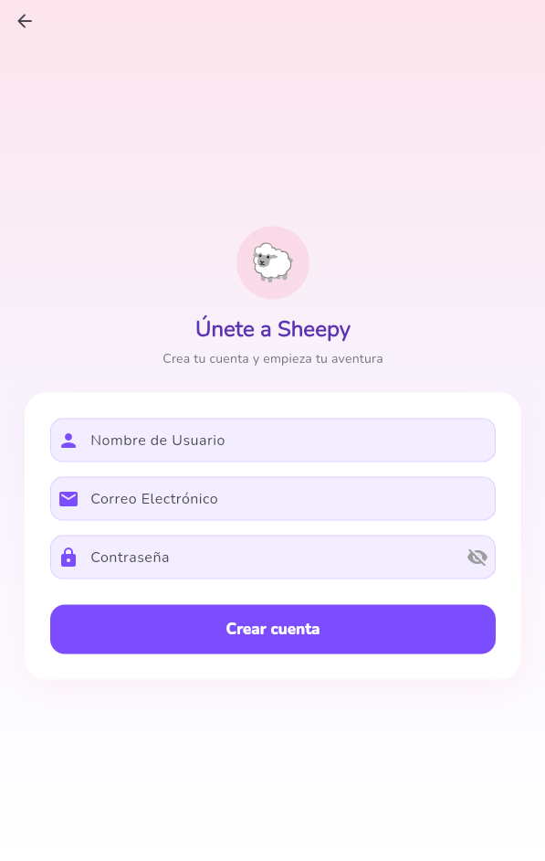
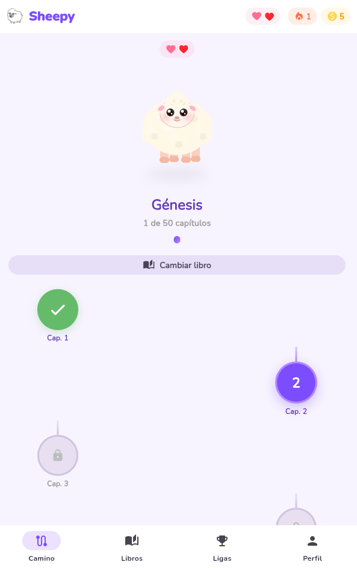
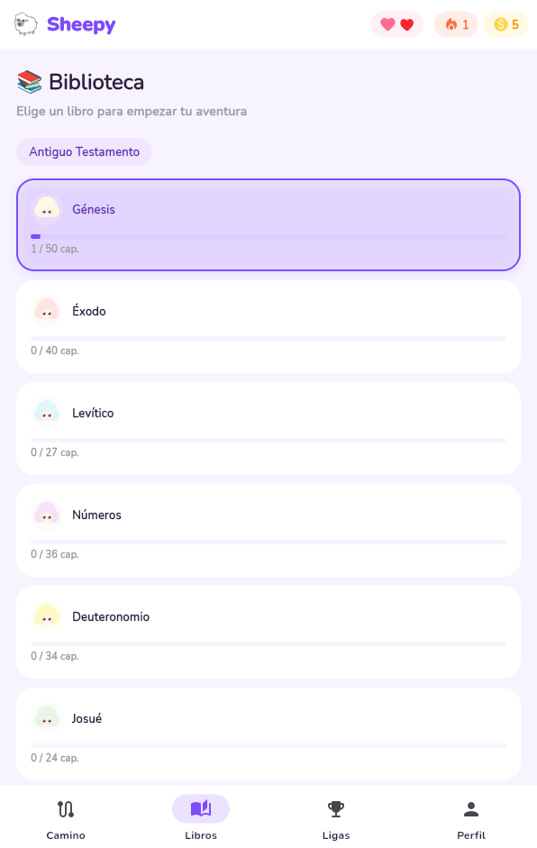
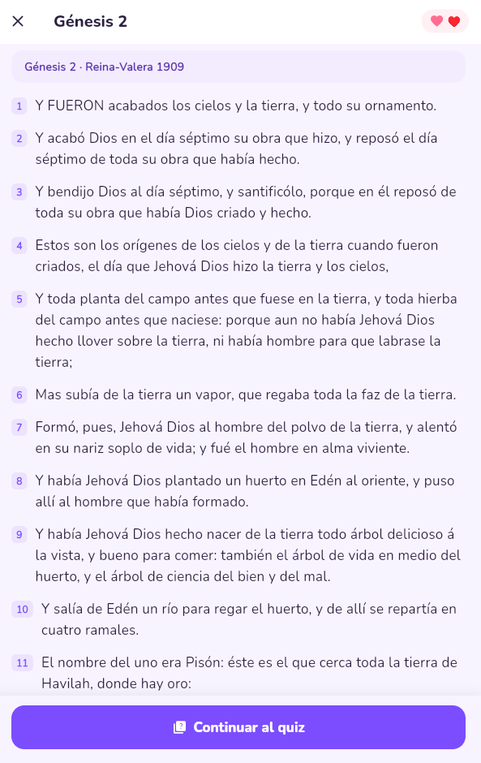
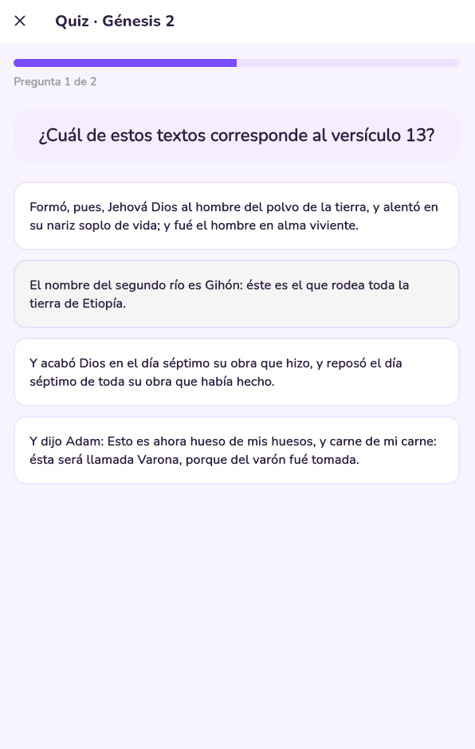
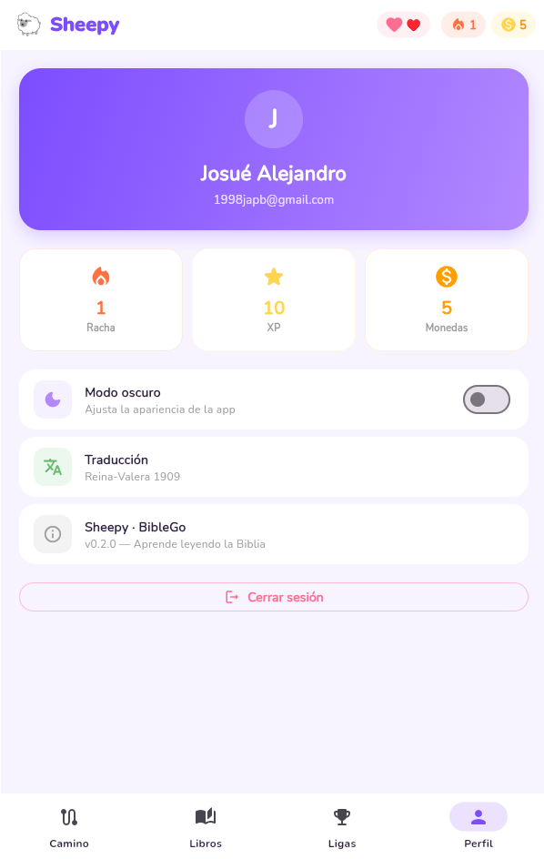

# Sheepy User Manual

Welcome to the Sheepy User Manual! This document provides a visual walkthrough of the main features and screens within the Sheepy application.

## 1. Authentication

To begin using the app, you must either create a new account or log in with an existing one.

### Registration & Login
- Click the **"Register"** button if you don't have an account. Fill in your username, email, and a secure password.
- If you already have an account, enter your credentials in the **Login** screen.

**Login**

**Registro**

## 2. Main Dashboard & Navigation

Once logged in, you will be greeted by the main interface, featuring our interactive mascot and your progress tracking.

### The Path (Main View)
The path displays a series of interconnected nodes, each representing a chapter in your currently selected book. 
- A fully colored node represents a completed chapter.
- A glowing node represents the next available chapter.
- Gray nodes are locked until previous chapters are completed.

**Path**

### Top Status Bar
At the top of the screen, you will always see your vital statistics:
- **Lives:** Represented by heart icons. You lose a life if you answer a quiz incorrectly. Lives regenerate over time.
- **Streak:** A fire icon tracking how many consecutive days you have interacted with the app.
- **Coins:** Earned by completing chapters and quizzes.

## 3. Selecting a Book

Navigate to the **Books** tab via the bottom navigation bar to explore the library.

- Books are categorized by Old and New Testament.
- Each book card displays your current reading progress and an adorable mini-mascot.
- Tap any book card to set it as your active book on the main Path.

**Books**

## 4. Reading and Learning

When you tap an unlocked chapter on the path, you enter the Reading Mode.

- The app displays the biblical text verse by verse in a clean, readable format.
- After finishing the reading, tap the **"Continue to Quiz"** button at the bottom of the screen.

**Reading**

## 5. Quizzes and Progression

The Quiz mode is where your knowledge is tested and your progress is validated.

- You will be presented with multiple-choice questions based on the chapter you just read.
- Tap an option to select your answer. Correct answers will light up the button, while incorrect answers will shake it and deduct one life.
- Completing a quiz successfully grants experience points (XP) and unlocks the next chapter on the Path.

**Quiz**

## 6. Competitive Leagues

Navigate to the **Leagues** tab to view your current standing among other users.

- Your accumulated experience points (XP) determine your position on the leaderboard.
- Earning enough points will promote you to higher tiers (e.g., Bronze, Silver, Gold).
- The leaderboard highlights the top 3 users with medals.

**Leagues**

## 7. Profile and Settings

The **Profile** tab allows you to manage your application preferences and view an overview of your account.

- **Stats Overview:** A quick summary of your streak, total XP, and total coins.
- **Dark Mode:** Toggle between light mode and a deep purple dark mode.
- **Log Out:** Securely sign out of your account.

**Profile/Settings**

Enjoy learning with Sheepy!
